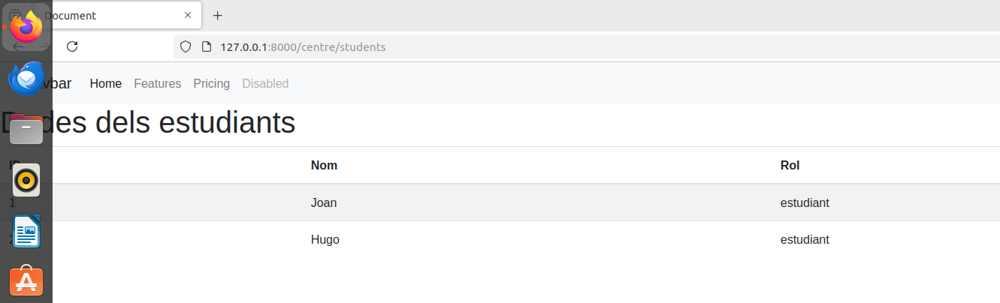
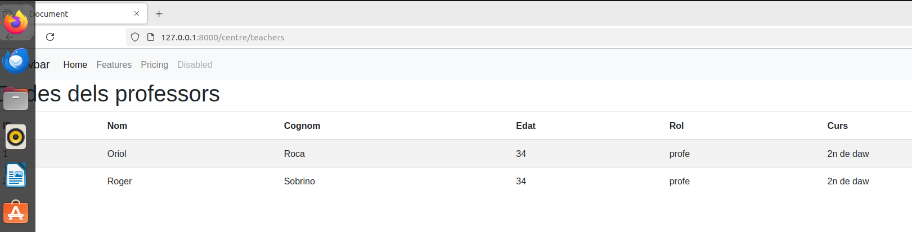
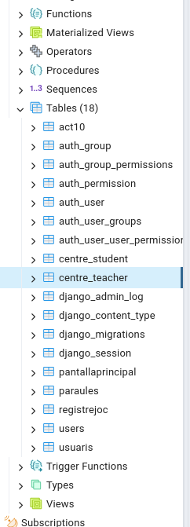

<h1>Documentacio de la activitat</h1>

<h2>Activitat 1</h2>

En aquesta activitat he creat els dos endpoints que demanava la practica i mostrar el resultat per pantalla captures a continuacio

<h2>Activitat 2</h2>

He afegit el navbar a dalt de tot amb una plantilla index.html que es renderitza  per als students i els teachers

<h2>Activitat 3</h2>

He creat un model de Teacher i students i fet la migracio de les taules a la base de dades postgres i a partir de aqui he creat els endpoints per a fer el insert a la base de dades, captura de la migracio a postgres a continuacio

