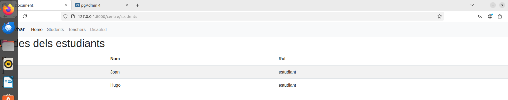
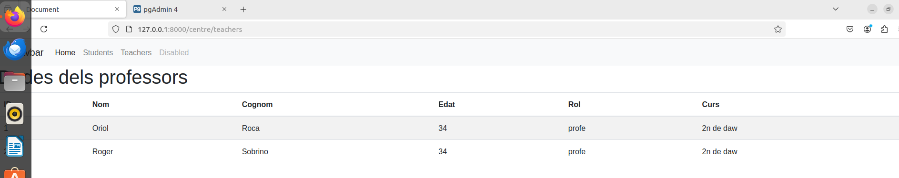
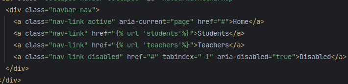

<h1>Documentacio de la activitat</h1>

<h2>Activitat 1</h2>

En aquesta activitat he creat els dos endpoints (views+url) que demanava la practica i mostrar el resultat per pantalla captures a continuacio, les dades que surten estan hardcodejades com una llista de diccionaris.

<h2>Activitat 2</h2>

He afegit el navbar a dalt de tot amb una plantilla index.html que es renderitza  per als students i els teachers i te els enllaços les URLS configurats per a entrar als students i als teachers desde el navbar

Aqui es poden veure els enllaços configurats a index.html

<h2>Activitat 3</h2>

He creat un model de Teacher i Student i fet la migracio de les taules a la base de dades postgres i a partir de aqui he creat les views i els endpoints per a fer el insert a la base de dades del postgres, captura de la migracio a postgres a continuacio totes les taules me les ha creat automaticament al fer la migracio i es pot veure en la primera captura que son las taules que tenia creades abans de fer la migracio i tota la resta s'ha creat despres de ferla

Un cop fet aixo he canviat les dades hardcodejades i en comptes d'aixo les agafo de la base de dades dels postgres amb el metode .objects.all()
