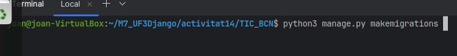

<h1>Documentacio de l'activitat 14</h1>

El sistema que he creat es un formulari on l'usuari fa login amb l'email i el password i quan li dona al boto de submit el redirigeix a un endpoint que fa la verificacio de l'usuari contra la BD i si es correcte s'inicia la sessio i després el redirigeix a la pagina d'inici on es torna a comprovar si l'usuari exiteix en la BD per si algú entra a l'inici sense estar a la base de dades o sense tenir la sessio iniciada a la pagina de inici i ha un boto per fer logout que quan es clica tanca la sessio de l'usuari i et redirigeix de nou al formulari de inici de sessio.

També i ha una altra aplicacio dins del projecte creada que es el pasApas fet desde el principi.

<h2>Configuració del projecte</h2>

Configuracio del projecte

<h2>Creacio de l'aplicacio</h2>

Comanda per crear la aplicació

<h2>Creacio del model</h2>

El model fet i les migracions a la BD de postgres

